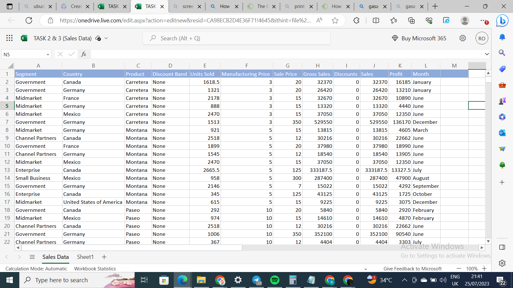
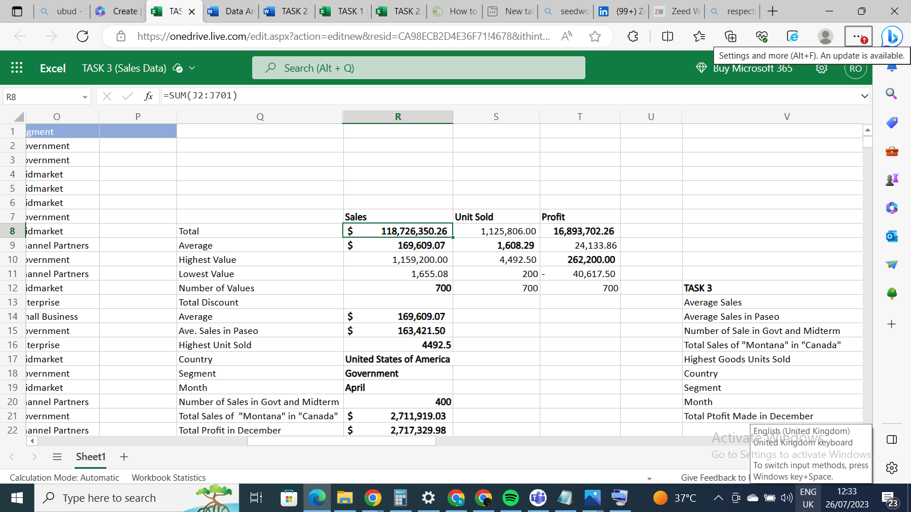
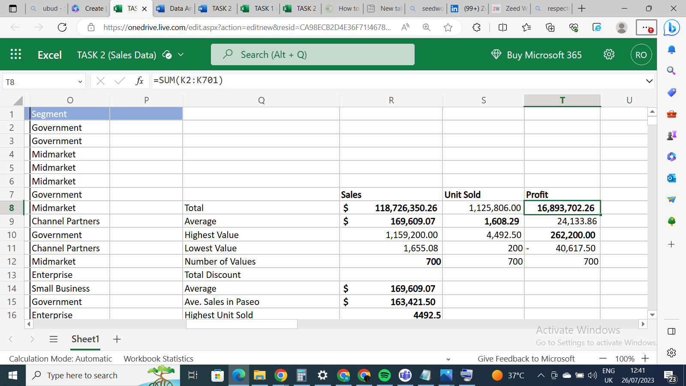
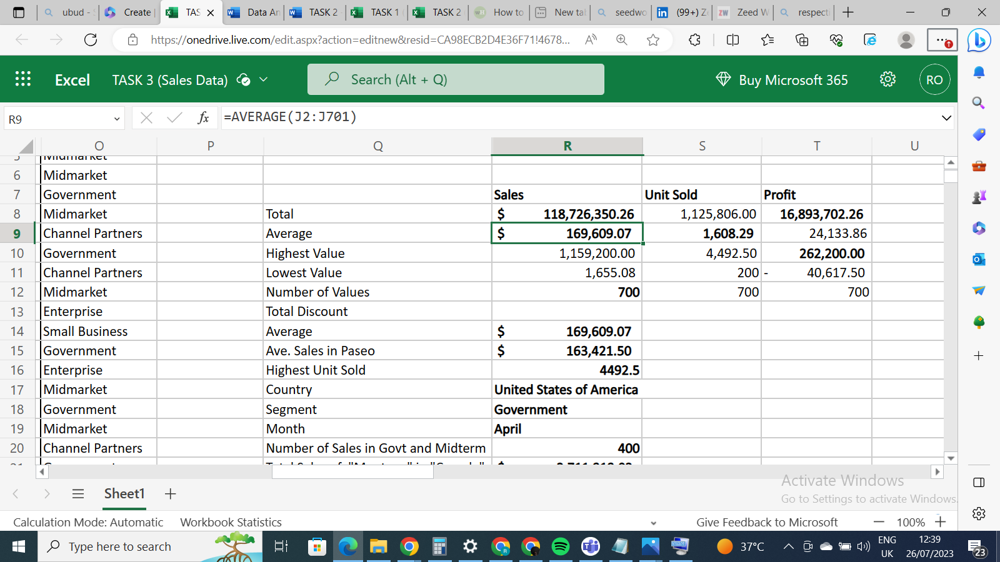
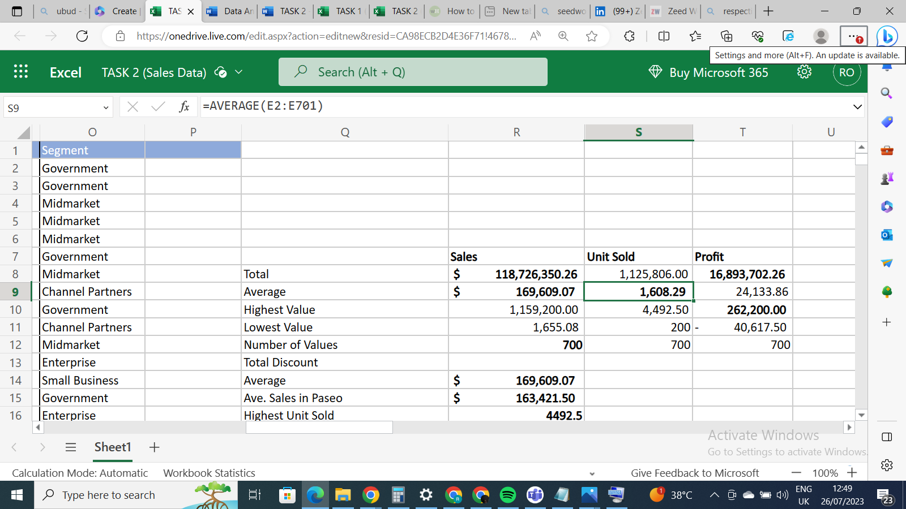
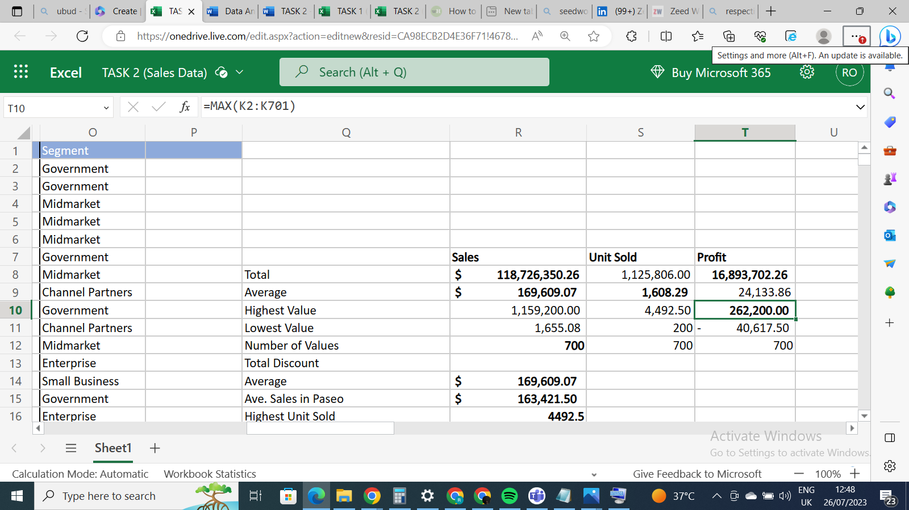

# Data-Analysis-Cohort-3_TASK2TASK 2 

## Introduction 
Welcome to the second task of the **3rd Data Analytics Cohorts** for Beginners facilitated by **Nonso Promise**, a data analytics Coach. We are provided with an Excel dataset entitled **“Sales Data”**. The dataset consists of 700 rows and 12 columns with 12 variables.  

## TASK 
Determine the following from the “Sales Data” dataset 
- Total Revenue and Profit generated 
- Average Revenue and Units Sold 
- Total Sales Value  
- Highest Profit Value 

## Skillset Demonstrated 
Some basic functions in Excel like: 
1. SUM 
2. AVERAGE 
3. COUNT 
4. MIN 
5. MAX etc 

## Dataset "Sales Data"
   

## The SUM Function
The SUM function adds values, either of individual values, cell references, given ranges, or a mix of all. To determine
the total revenue generated in this dataset, I added up all the values in column **"J"** which is the **Sales** column. Syntax=SUM(J2:J01). In like manner, to determine the total profit generated, I added up all the values in column "K", which is the **Profit** column. Syntax=SUM(K2:K701)
 
   
  
  

  ## The AVERAGE Function
  The AVERAGE function is the arithmetic mean of given values. It could be in number, percentage, or time. To determine the 
 average revenue generated in the Sales Data, I used the average function, =AVERAGE(J2:J701) to seek the average of 
  the numbers in cells J2:J701, which is the Sales column. The same for the average unit sold, I used the average function, =AVERAGE(E2:E701) to seek the arithmetic mean of values in the Unit Sold (J) column
  
  
  
  

## The MAX Function
 The MAX function returns the largest value in a set of values. In this task, column (K) is the Profit column. To know the Highest profit values of this dataset, I used the MAX Function to seek the highest value in the Profit column, =MAX(K2:K701).
 

 ## Conclusion
 This task has exposed me to more usage of basic Excel functions. I promise to do more of this here. Stay tuned.
 Thank you all.
 

  
  

  

  

  

 

 
